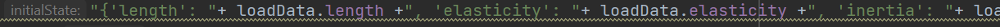

## BACKEND OF THE APPLICATION
- For the backed we are using python.
- The backend could be further devided into two parts:
  1. The solver engine:
     1. The engine is built with Scipy and numpy.
     2. The engine mimics the working of simulinks linear equation solver.
     3. This returns the step vectors for next iterations.
     4. Each vector will be used by the frontend to display realtime updates on Graph
  2. The APIs
     1. The APIs are used to expose the engine to the client apps.
     2. The APIs were made using Flask.
     3. The APIs are using socketio for connection.
     4. The url on the client side should be updated with things like properties, beam length etc.
     
     5. This url is processed on the server side to get plotting data for next steps.