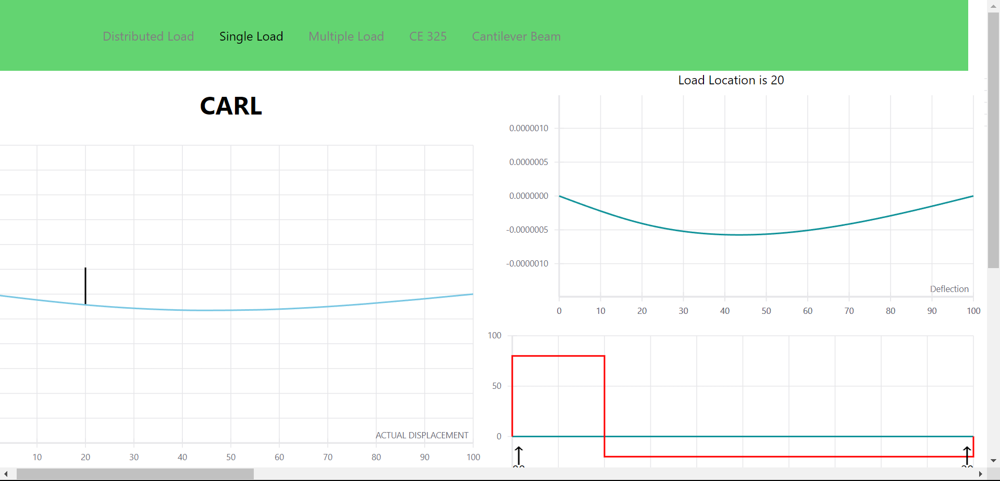
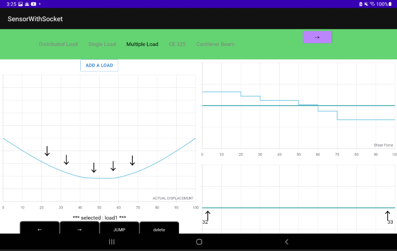
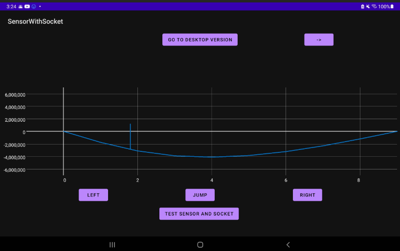

## Frontend of the app
The front end of the application has implementations for 2 platforms. The first one is android and another one is for web.

### Web implementation-
- The web version was implemented with React.
- This app has multiple pages and is responsive to allow user to open it even on their mobile's browser.
- App also uses react routers.
- socketio-client is used to connect with the backend and get data for graphs
- reactvis is the plotting library used.
  - 
### Android Implementation-
- The android version has been implemented using Java.
- The reason to use android was to enable the sensors to detect jump, step or directional changes.
- The application itself has two parts. One is the native render to plot the graphs. The second is to use the web version of the application but use sensors for input.
- The app uses livedata api extensively.
- The socketio-client is used to connect with th webhosted backed.
  - 
  - 